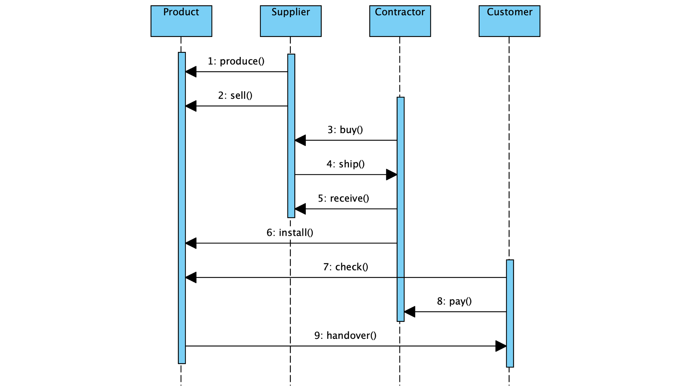
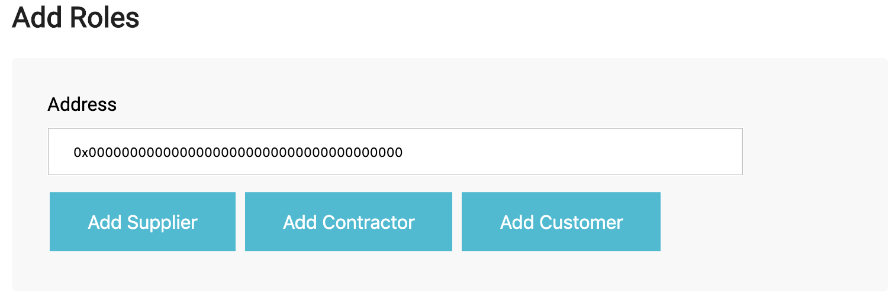
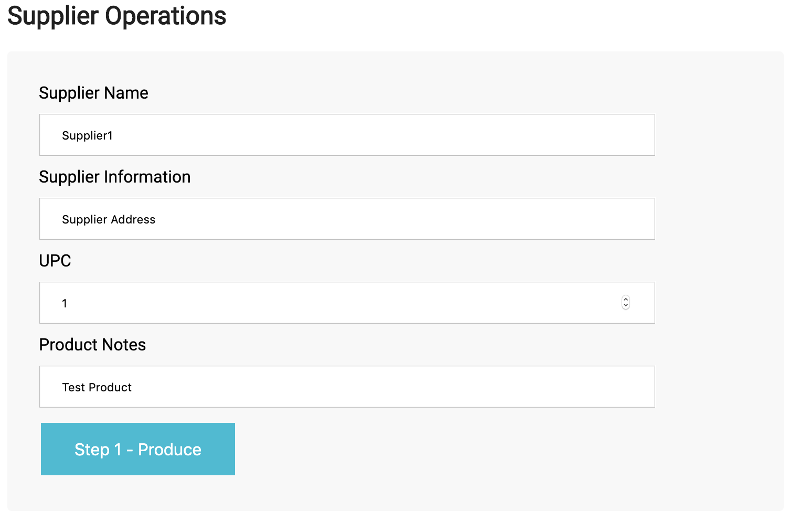

# Ethereum Elux Supply Chain DApp
This repository contains an [Ethereum](https://www.ethereum.org/) DApp to track items through a Supply Chain.

## Overview
The following activity diagram illustrates the supply chain process. A supplier can produce an item and sell it to a contractor. After shipment, the contractor installs the item. The customer checks the correct installation and if correct, pays the contractor to handover the item. If the installation was not correct, the contractor has to redo the installtion.

<br class=”blank” />

<br class=”blank” />

The sequence diagram shows all necessary transactions to follow the process above. 

<br class=”blank” />

<br class=”blank” />

The nine possible product states are shown in the state diagram with the transactions that trigger this state.

<br class=”blank” />

<br class=”blank” />

The data diagram illustrates the data structure. Access control is ensured for all participants through four smart contracts `Roles.sol`, `SupplierRole.sol`, `ContractorRole.sol` and `CustomerRole.sol`. The base contract is the main supply chain contract `SupplyChain.sol`, ensuring the logic of the process. Finally, the core contract `Ownable.sol` provides basic authorization control.

<br class=”blank” />

<br class=”blank” />

## DApp Functionality
Following the presented logic in the previous chapter, the DApp browser-interface enables the user interaction with the smart contracts. First, roles can be added to accounts. At first, only the owner of the smart contracts has all roles and can add additional roles to other accounts.

<br class=”blank” />

<br class=”blank” />

The item overview allows every account independent of its role to fetch information about the items based on its SKU (stock keeping unit), at any point in time. The SKU is a sequential integer starting from 1 and incrementally increasing with each added item.

<br class=”blank” />

<br class=”blank” />

Supplier operations can only be called by an account with a supplier role or the smart contract owner. The first step is to produce an item. The supplier name and information need to be added, together with a UPC (universal product code) and the product notes.

<br class=”blank” />

<br class=”blank” />

After producing an item, the supplier can decide to sell its item. For that he needs to specify the SKU of the item and the product price in Ether.

<br class=”blank” />

<br class=”blank” />

After he sold the item, he can ship it to the contractor.

<br class=”blank” />

<br class=”blank” />

Contractor operations can only be called by an account with a contractor role or the smart contract owner. A contractor can decide in a third step to buy an item from the supplier. He needs to enter his credentials, and also the Ethereum-address and name of the customer he will install the item for. Finally, he needs to fill in the amount he wants to pay, which needs to be more than the sales price specified by the supplier. Change will be sent back to the contractor.

<br class=”blank” />

<br class=”blank” />

When the contractor received the item, he needs to call the receive function to claim ownership of the item.

<br class=”blank” />

<br class=”blank” />

He then can proceed with installing the item, specifying the cost of installment.

<br class=”blank” />

<br class=”blank” />

Customer operations can only be called by an account with a customer role or the smart contract owner. After the contractor installed the item, the customer can check the correct installation. He indicates his assement with `true` or `false`. If false, the contractor has to redo the installation and the customer needs to check again.

<br class=”blank” />

<br class=”blank” />

If correctly installed, the customer can pay the contractor. The amount needs to be the total price (product price + installation price).

<br class=”blank” />

<br class=”blank” />

Finally, the customer can claim the item by calling the handover function.

<br class=”blank” />

<br class=”blank” />

## Getting started
### Test on local Ganache network
Clone this repository and change to the project directory. Install all requisite npm packages (see file `package.json`):
```
npm install
```
Launch Ganache with the following seed to get the correct test accounts:
```
ganache-cli -m "spirit supply whale amount human item harsh scare congress discover talent hamster"
```
Open a separate terminal window (still in the project directory). Compile and migrate the smart contracts:
```
truffle compile
truffle migrate --reset --network development
```
Test the smart contracts (see file `TestSupplychain.js`):
```
truffle test
```
All 12 tests should pass. In a separate terminal window, launch the DApp:
```
npm run dev
```
Point Metamask to your localhost network and import the needed private keys. You are ready to go!

### Deploy on public Rinkeby test-network
 First, make sure you have Metamask installed in your browser and a sufficient amount of Ether on your Rinkeby-accounts. Create two files in the repository `.secretInfuraKey` and `.secretMnemonic`, where you enter your [Infura Key (Project ID)](https://infura.io) (optained from a new project on your Infura account pointing to the Rinkeby network) and Metamask Mnemonic, respectively. As for the local test-network deployment, make sure that you have installed the required npm packages. If not already done, run in your repository:
```
npm install
```
Open a separate terminal window and compile and migrate the smart contracts:
```
truffle compile
truffle migrate --reset --network rinkeby
```
Check if the deployment was successfull on [rinkeby.etherscan.io](https://rinkeby.etherscan.io). Launch the Dapp from a separate terminal window:
```
npm run dev
```
Point Metamask to the Rinkeby network. You are ready to go.

The contracts have already been deployed to the Rinkeby network and tested:
- SupplierRole.sol: [Transaction Hash](https://rinkeby.etherscan.io/tx/0x5c168901add9605bdf72923a59dfb845977b1feb67fa52034e6c08f309730d94), [Contract Address](https://rinkeby.etherscan.io/address/0x4b22516cd3cc3aea399ce9362ea92ba503467af4)
- ContractorRole.sol: [Transaction Hash](https://rinkeby.etherscan.io/tx/0x8848ad2b5237a37c4513ff0e4f7206d5c555b93e151ff40a1c76c2c8f4d7541c), [Contract Address](https://rinkeby.etherscan.io/address/0x3b5fee8b59a8dd8aee77bd2386ab9d23d610c9fb)
- CustomerRole.sol: [Transaction Hash](https://rinkeby.etherscan.io/tx/0xa8dac0505e91b93a0c144da92d96f21693410224ec6662945546e57725f6af91), [Contract Address](https://rinkeby.etherscan.io/address/0xb7a10d2bdc40ca6b3bb258df2df81983d82cff62)
- SupplyChain.sol: [Transaction Hash](https://rinkeby.etherscan.io/tx/0x0c5f1f145e7fc181d691bd17fae9234121ba050b3d11ca0b16638b899c03df59), [Contract Address](https://rinkeby.etherscan.io/address/0x6402fC4DeA2474B816c98D065478a3cC7EA325b5)


## Prerequisites
* [Truffle Suite](https://truffleframework.com/) (v5.0.3)
* [node.js](https://nodejs.org/en/) (v10.15.0)
* [Metamask](https://metamask.io/)
* [Infura](https://infura.io/)

The contracts `Ownable.sol` and `Roles.sol` are based on the [OpenZeppelin](https://docs.openzeppelin.org/docs/get-started.html)-library. It is possible to adjust the code to a direct import from the library. Then the installation is a prerequisite. As it is now, this is not needed.